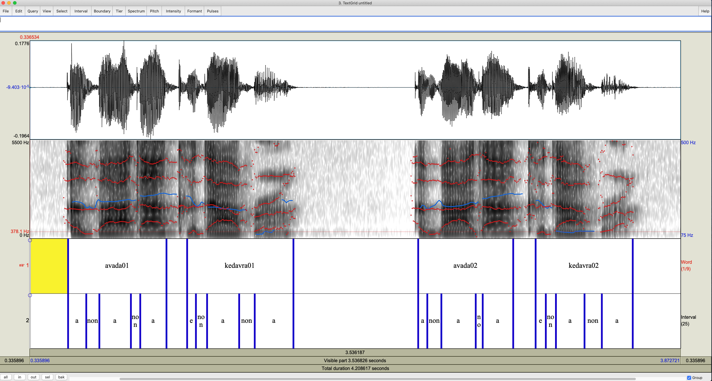
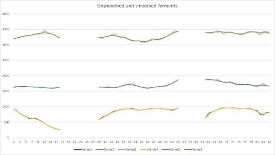
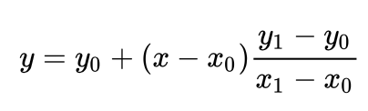

# A tool for formant/EMA data extraction and alignment with word, repetition  and interval labelling. Non voiced intervals can be specified.
This is a tool for Praat users to extract formant data from a wav and corresponding text grid file. The resultant time series dataframe will be in the long format.

It is especially useful when your intervals of interest contain sub-intervals of interest, as well as when there are non-voiced portions that need to be retained in the final data. The labelled voiceless portions will have blank formant values and will show up as NaN in pandas and NA in R. 

Figure 1 shows one scenario where this tool might be useful.

 

(Figure 1)

Figure 2 shows both smoothed and unsmoothed formant trajectories of the first interval (i.e. avada01) in Figure 1

(Figure2)

### Feature highlights:
- A trimming algorithm adapted from [FormantPro](http://www.homepages.ucl.ac.uk/~uclyyix/FormantPro/) is used to smooth out irregular spikes or dips in the signal. The trimmed values are replaced with linearly interpolated values with the equation below: 

(equation 1)

- The script also implements a simple unweighted rectangular smoothing algorithms as shown below (the number of smooths can be specified):  

(equation 2)

- Time series can be aligned according to a specified boundary as shown below in Figure 3. When aligning, the time series are aligned at the boundary specified by the user (e.g. at the end of interval A in Figure 3). The portion before the alignment point is trimmed to be the same length as the shortest as the res line shows (e.g. trajectory 1 in Figure 3).
- If future analysis requires time normalisation, such as SSANOVA or functional analysis, the aligned time seires can be further trimmed to be the same length as the shortest one overall, as shown by the yellow line (e.g. trajectory 3 in Figure 3).

(Figure 3)

- EMA data can be simultaneously segmented and corresponded to the formant data. The EMA data is interpolated with the time information provided in the RealTime column. If a data point with the corresponding time exists in the raw data, no interpolation takes place.

## Prerequisites:
- The getFormantData script for getting raw/unaligned data or data aligned across repetitions:
 1. For each speaker, his/her recordings need to be in one folder with corresponding file names between the audio, textgrid or EMA files. Multiple recordings are allowed, as long as the file names correspond correctly.
 2. Audio files should be in the wav format. Avoid having special characters in the textgrid file.
- Process EMA with the getFormantData script:
 1. The head corrected EMA data need to be in the long format, i.e., the data should be arranged such that each sensor's measurement is in its own column, and each row should contain observations/position values at one time. Examples can be found in the Carstens_ema folder.
 2. There needs to be a txt file containing the measurement labels you wish to extract data from in the folder. Each label should start its own line. **The labels need to be identical to that of the column names in your EMA data.**
- The alignSpeakers script to align raw trajectories across all speakers:
 1. Genarate the **raw/unaligned** trajectories for all speakers separately.
 2. Put all speakers data files in the same folder, **as well as a text file containing the word list with each word starting its own line**. An example for the word list file can be found in the examples folder.
 
## Instructions:
### getFormantData:
- Fill in the initial settings accordingly. Speaker label should be specified such as S1 or name initials without quotation marks. Voiceless intervals can be specified in the *Nonvoiced interval label* field. If there are no voiceless intervals please ignore the field. The resultant data file name can be specified in *Data file name*. **The working directory must be filled in as an absolute path or a relative path to where the script is.** It is advised to use absolute path here.
- Fill in the formant settings accordingly.
- For the Procedure obtions, if *Align repetitions* is chosen, the time series will be aligned as mentioned above. If *Get raw trajectories* is chosen, the time seires will be segmented according to your labels and no alignment will be done.
- If *Align repetitions* is chosen, the alignment boundary will need to be specified in the *Align at the end of boundary labelled* field. A prompt will also appear later for the user to specify whether time series need to be trimmed further so all trajectories are the same length.
- If EMA data needs to be segmented according to the labelled formant data, please check the box for *Process EMA data*. A pop up window will occur after formant data has been processed, fill the form accordingly and the EMA data will be in the final dataset.

-----
### alignSpeakers:
- Instructions are similar to *getFormantData*. Please note that the sampling rate used to generate raw trajectories need to be kept constant between speakers and specified in the *Sampling rate* field.
- The file name of the word list file needs to be specified in the *Word file name* field.
- A repetition number need to be specified in the *Repetition number* field. If repetition between item or speaker is uneven, input the highest repetition used.

## Output

Example outputs from getFormantData can be found in the examples folder. Note that alignedTrimmed.csv is generated from aligning and trimming while aligned.csv is only aligned and not trimmed across all time seires.

For processing EMA data, examples can be found in the Carstens_ema folder. The template data is obtained from a Carstens AG501 system.

