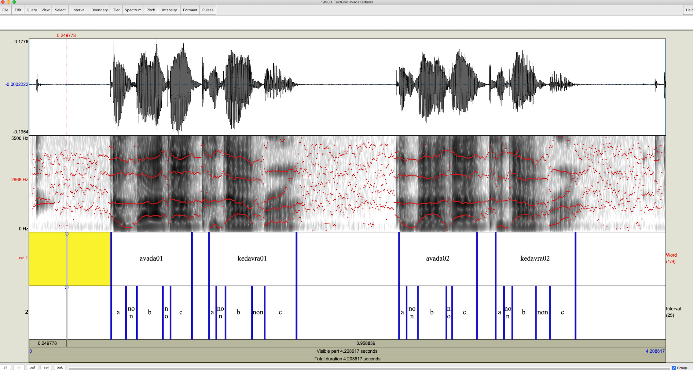

## A tool for formant extraction with word, repetition  and interval labelling. Non voiced intervals can be specified.
This is a tool for Praat users to extract *smoothed* formant data from a wav and corresponding text grid file. The resultant time series dataframe will in the long format.  

It is especially useful when your intervals of interest contain sub-intervals of interest, as well as when there are non-voiced portions that need to be retained in the final data. The labelled voiceless portions will have blank formant values and will show up as NaN in pandas and NA in R. 

A trimming algorithm adapted from [FormantPro](http://www.homepages.ucl.ac.uk/~uclyyix/FormantPro/) is used to smooth out irregular spikes or dips in the signal.  

The script also implements a simple unweighted rectangular smoothing algorithms as shown below:  
  

The image below shows one scenario where this tool might be useful.

## Instructions:
1. Label your wav file with a corresponding text grid file in the format shown above.
2. Put the sciprt, wav file and text grid file in the same folder.
3. Open the script in Praat by Open-->Read from file, then run the sciprt.
4. Fill in the form accordingly. Note that file extensions do not need to be included. If there are voiceless intervals, specify the label used for non-voiced portions in the interval tier. If there are *no* voiceless intervals, leave the field blank.  
5. Note that you can specify how many times to apply the smoothing filter, the default is twice. You can also choose to not use the rectangular filter by specifying smoothing to be 0. Note that the trimming algorithm will still be apllied.

### The resultant data will consist of 11 columns (file named )

- WordRep: the label used in the first labelling tier.
- Word: the corresponding word without repetition number.
- Interval: the label used to indicate intervals in the second labelling tier.
- RealTime: time relative to the original wav file.
- TimeL time relative to the utterance.
- *Unsmoothed* formant columns(F1; F2 and F3).
- *Smoothed* formant columns(F1_s; F2_s and F3_s).

